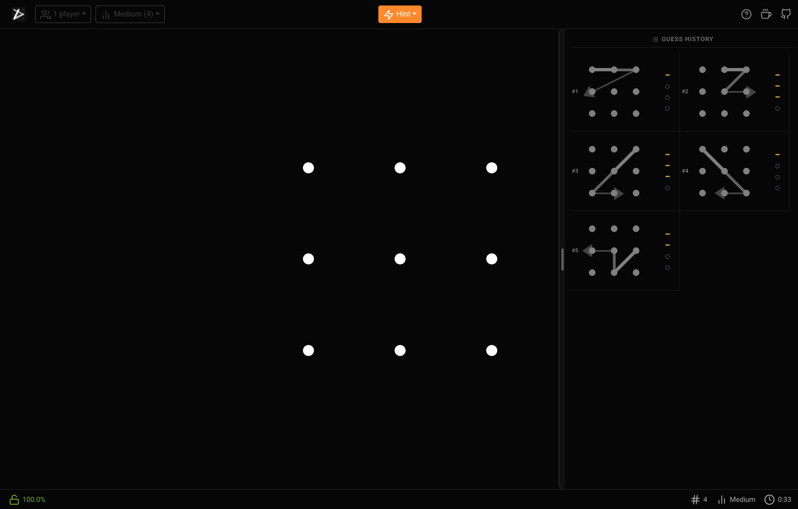

# locker-hacker

A *Bulls and Cows* code-breaking game played with pattern lock paths over a grid of dots.



Yeap. As you might think, this is yet another game development project of mine.
If you haven't done it yet, I highly recommend checking the other ones I have on GitHub:

- [Pacman](https://github.com/virgs/pacman)
- [Minesweeper AI](https://github.com/virgs/minesweeper-ai)
- [Flappy Bird AI](https://github.com/virgs/flappy-bird-ai)
- [2048 AI](https://github.com/virgs/2048-ai)
- [Rubik's Cubes AI](https://github.com/virgs/rubiks-cubes-ai)
- [Mancala](https://github.com/virgs/mancala)
- [Tetris](https://github.com/virgs/tetris)
- [Navigator's Gamble](https://github.com/virgs/navigators-gamble)

## How It Works

A hidden code is a **sequence of distinct dots** drawn on a rectangular grid. Players submit guesses and receive feedback:

* **Bulls** — dots correct in both identity and position
* **Cows** — dots present in the code but in the wrong position

The game ends when Bulls == code length.

## Features

* **Level selection** — Easy (3×2, length 3), Medium (3×3, length 4), Hard (3×3, length 5), Expert (4×3, length 5)
* **Hint dropdown during play** — the center action is a Hint menu with `Get a hint` (hides one random non-code dot while keeping the lock geometry intact) and `Give up` (reveals the code)
* **Larger mobile dropdown targets** — navbar dropdown items now use taller touch targets, and the hint menu routes actions through dropdown selection so `Give up` works reliably on phones
* **Reliable stats persistence** — single-player games are persisted from the first valid guess, wins are finalized immediately on solve, and abandoned runs still count as losses after reload or restart
* **Smoother hard-mode guess flow** — post-guess UI resets now render at higher priority, while the heavier AI/history work is deferred so the lock becomes playable again faster
* **Build-aware stats modal** — the stats view shows the running app version and, in CircleCI deployments, the deployment build number for quicker debugging
* **Expert stays playable** — AI confidence analysis is disabled automatically for oversized boards like Expert, preventing browser lockups from impossible candidate generation
* **Hidden stats reset** — while the stats modal is open, tapping the build label 7 times within 5 seconds clears saved stats immediately
* **Gesture-driven guess history** — the desktop history rail can be dragged from anywhere in the visible panel, while the mobile bottom sheet still supports direct title-bar dragging and now keeps collapsing/expanding naturally when scroll gestures run out at the top or bottom edge
* **Taller mobile guess-history preview** — on smaller screens, the collapsed bottom history sheet is taller so at least four recent guesses stay visible before you need to scroll
* **Deterministic history auto-scroll** — guess history now scrolls from a single code path, so new guesses and collapse-to-latest behavior stay consistent instead of competing with nested smooth-scroll calls
* **Latest guess preserved on collapse** — when the guess history panel collapses, its scroll position snaps back to the bottom so the newest guesses stay visible
* **Dot annotations while solving** — press and release a dot without dragging to cycle your own current-game notes through `clear -> eliminated -> confirmed -> confirmed 1..N -> clear`, where numbered confirmations are larger green labels placed clockwise around the ring for the active code length
* **Web-only deployment** — Android/Capacitor support and AdMob integration have been removed for now, so the app targets the GitHub Pages web build only
* **Player count** — Select 1–4 players (future multiplayer support)
* **Help modal** — In-app game rules with a "Play Now" button
* **Shareable previews** — Open Graph metadata now uses the gameplay screenshot and a tailored description for richer social link previews
* **Responsive** — Works on desktop and mobile, navbar wraps to two rows on small screens

## Game Rules

* No dot may appear twice in a code or guess.
* A move is invalid if the straight line to the target passes through an unvisited dot (same as `allowJumping=false` in the pattern lock component).

See [rules.md](./rules.md) for the full specification.

## Architecture

```
src/
├── ai/                  # AI inference engine (candidate elimination)
│   ├── types.ts             — shared types (DotId, Path, Observation, etc.)
│   ├── CandidateGenerator.ts — enumerates all valid paths via DFS
│   ├── CandidateFilter.ts    — filters candidates against observed feedback
│   ├── SummaryBuilder.ts     — computes domains, mustHave/mustNotHave, progress
│   └── InferenceEngine.ts    — orchestrates candidate generation & filtering
├── components/          # React components
│   ├── PatternLock.tsx        — main grid + drawing component
│   ├── PatternLock.styled.tsx — global CSS-in-JS styles
│   ├── PatternHistory.tsx     — renders the list of past guesses
│   ├── Navbar.tsx             — game controls (dropdowns, play/reveal, help)
│   ├── HelpModal.tsx          — how-to-play modal
│   ├── CodeRevealOverlay.tsx  — secret code reveal modal
│   ├── Connectors.tsx
│   ├── Point.tsx
│   └── usePatternLock.ts
├── game/                # Game logic (pure TypeScript, framework-agnostic)
│   ├── CodeGenerator.ts   — generates a valid hidden code
│   ├── GameConfig.ts      — level/player types and constants
│   └── GuessValidator.ts  — computes bulls/cows feedback
├── math/                # Geometry utilities shared by game and component
│   ├── math.ts
│   ├── grid.ts          — coordinate ↔ id conversion utilities
│   └── point.ts
└── theme/               # Centralized design tokens
    ├── breakpoints.ts   — responsive breakpoint constants
    └── feedbackTheme.ts — feedback colors, symbols, and labels
```

### `CodeGenerator`

```ts
import { CodeGenerator } from './src/game/CodeGenerator';

const gen  = new CodeGenerator({ cols: 5, rows: 5, length: 4 });
const code = gen.generate(); // e.g. [0, 12, 7, 18]
```

### `GuessValidator`

```ts
import { GuessValidator } from './src/game/GuessValidator';

const validator = new GuessValidator(code);
const feedback  = validator.validate(guess); // { bulls: 1, cows: 2 }
const solved    = validator.isSolved(guess); // true when bulls === code.length
```

### AI Inference Engine

The `src/ai/` module narrows down possible secret codes using candidate elimination. It enumerates all valid paths, then filters them as guesses and feedback accumulate.

```ts
import { InferenceEngine } from './src/ai/InferenceEngine';

const engine  = new InferenceEngine({ cols: 3, rows: 3, length: 4 });
const summary = engine.applyAll([
    { guess: [0, 1, 4, 3], feedback: { bulls: 1, cows: 2 } },
]);
console.log(summary.progress.candidateCount); // remaining possibilities
console.log(summary.mustHave);                // dots in every candidate
```

See [ai-inference-rules.md](./ai-inference-rules.md) for a plain-language explanation of the AI inference logic and rules.

## Development

```bash
pnpm install        # install dependencies
pnpm dev            # start dev server
pnpm test           # run tests
pnpm test:coverage  # run tests with coverage report
pnpm lint           # lint
pnpm lint:fix       # auto-fix lint issues
pnpm build          # production build (outputs to docs/)
```

## CI/CD

A CircleCI pipeline (`.circleci/config.yml`) runs on every push:

| Job | Description |
|---|---|
| **install** | Installs dependencies with `pnpm install --frozen-lockfile` |
| **lint** | Runs ESLint |
| **test** | Runs the Jest test suite |
| **coverage** | Runs tests with coverage report |
| **build** | Compiles TypeScript and builds with Vite into `docs/` |
| **deploy** | Commits the `docs/` folder to `main` for GitHub Pages (main branch only) |

The deploy step is configured for non-interactive GitHub auth (seeded `known_hosts`, token-based push URL, and `GIT_TERMINAL_PROMPT=0`) to avoid hanging jobs.

The production build outputs to `docs/` with `base: '/locker-hacker/'` for GitHub Pages hosting.
